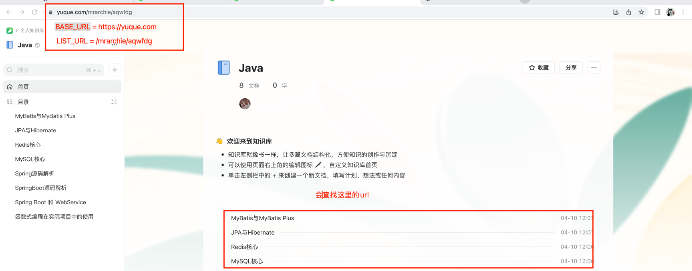

# yuque-exporter

基于Selenium导出语雀文档为MarkDown

## 使用说明


修改这里的参数即可
> - 随着语雀web的更新，功能可能会失效，需要修改源码
> - 目前只支持导出MarkDown，你可以自己添加其他逻辑，实现导出其他的功能
```java
public static final String BASE_URL="https://xxx.yuque.com";

public static final String USERNAME="xxxx";

public static final String PASSWORD="xxxxxx";

public static final String LIST_URL="/xxx/xxx";
```

